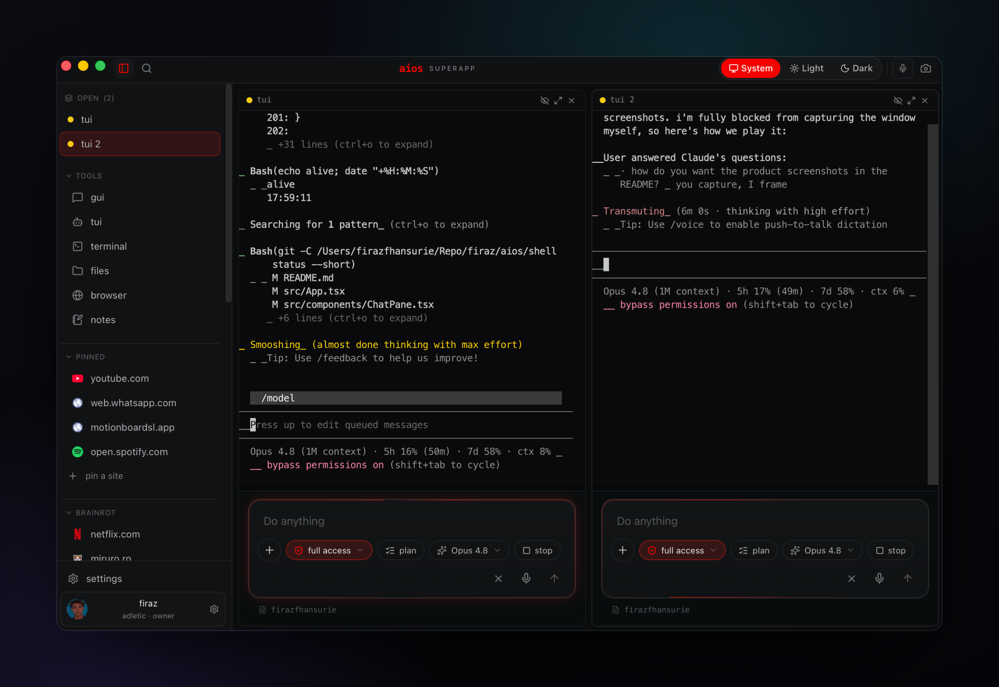

# Cockpit

> a lean tauri mission-control deck for ai agent sessions — spawn terminals and
> oracles, chat with your local `claude` cli, browse the web, dig through files,
> fly your memory graph in 3d, and talk to it all by voice. one window, native,
> fast.

Cockpit is a desktop "cockpit" for driving AI coding agents. It wraps a Rust
(Tauri v2) backend and a React + xterm.js frontend into a single native window
where every pane is a tool: terminals, an agent roster, a Codex-style chat
backed by your local `claude` CLI, an embedded browser, a file explorer, a
3D memory graph, automations, bridges, and a plugin/skill catalog. It's the
control surface for the [AIOS](https://github.com/ferazfhansurie/aios) stack —
but it degrades gracefully and runs fine on a plain machine with nothing but a
terminal.

---

## ✨ Features

- **Terminals** — real PTYs streamed per-session over a Tauri Channel, rendered
  with xterm.js + the WebGL addon. Open as many as you want.
- **Oracle roster** — spawn, rename, attach, and kill `tmux`-backed agent
  sessions ("oracles") from a sidebar. A pinned, undeletable master session sits
  on top. No tmux? The roster just shows empty.
- **Chat** — a Codex-style chat pane that streams from your local `claude` CLI
  (`stream-json`), so the conversation runs on your own Claude subscription with
  no extra keys.
- **Browser** — an embedded web view for docs, dashboards, and previews without
  leaving the deck.
- **Files** — a fast file explorer + reader for poking around your projects.
- **Memory graph** — a 3D force-directed view of your local markdown "memory"
  vault: every note is a node, every `[[wikilink]]` an edge. Click to read.
- **Automations** — surface and trigger your scheduled jobs / routines.
- **Bridges** — status of any connected bridges (e.g. a WhatsApp relay).
- **Plugins / skills** — a catalog of your AIOS skills (parsed from the skill
  index) plus the MCP servers wired into your `~/.claude.json`.
- **Push-to-talk voice** — hold to record, transcribe via a local whisper.cpp
  server, drop the text straight into chat.
- **Appshot** — ⌘⌘ grabs a screenshot and pipes its path into an agent session
  for instant visual context.
- **Command palette** + theming, so you can keep your hands on the keyboard.

## 📸 Screenshots

| Deck | Memory graph | Chat |
| --- | --- | --- |
|  |  |  |

> _Screenshots live under `docs/screenshots/` — drop your own in to replace the
> placeholders._

## 🚀 Requirements

- **macOS** (primary target; the Tauri shell is cross-platform but the agent
  integrations assume a Unix host).
- **Rust** (stable, via [rustup](https://rustup.rs)) — for the Tauri backend.
- **Node** 18+ and **pnpm** — for the frontend.
- _Optional:_ **tmux** + a running **`claude` CLI** on your `PATH` — needed for
  the chat pane and the oracle roster. Without them those panes are simply empty.
- _Optional:_ a **whisper.cpp** server on `:9000` — needed for push-to-talk
  voice transcription.

## 🛠 Build & Run

```bash
pnpm install          # install frontend deps
pnpm tauri dev        # run the cockpit in dev (hot-reload frontend + backend)
pnpm tauri build      # produce a release bundle
```

(`pnpm tauri` proxies the Tauri CLI; `pnpm dev` runs just the Vite frontend.)

## ⚙️ Configuration

Everything below is **optional** — Cockpit picks sensible defaults and runs with
none of it set. Use these env vars only to point Cockpit at a non-default AIOS
layout:

| Variable | What it does | Default / fallback |
| --- | --- | --- |
| `AIOS_MEMORY_VAULT` | Absolute path to your markdown memory vault for the 3D graph. | If unset, Cockpit looks for `$HOME/.claude/projects/<encoded-$HOME>/memory`, then the first `$HOME/.claude/projects/*/memory`, then `$HOME/.claude/memory`. None found → empty graph. |
| `AIOS_SKILL_INDEX` | Absolute path to your skill index (`_INDEX.md`) for the plugins pane. | If unset, `$HOME/.claude/skills/_INDEX.md`, then the first `$HOME/.claude/projects/*/skills/_INDEX.md`. None found → empty plugin list. |
| `AIOS_ORACLE_SOCKET` | tmux socket the bridge runs agent ("oracle") sessions on. | `adletic` |
| `AIOS_MASTER_SOCKET` | tmux socket the pinned master session lives on. | `aios` |
| `AIOS_MASTER_SESSION` | name of the pinned master session. | `aios` |

The MCP server list is read from `~/.claude.json` automatically (no config).

## 🧩 Architecture

```
src/            React + TypeScript frontend (Vite)
  components/     one file per pane (Terminal, Oracle, Chat, Browser, Files,
                  Memory, Automations, Bridges, Plugins, Voice, …)
  lib/            thin Tauri-invoke wrappers + the pane event bus
src-tauri/      Rust (Tauri v2) backend
  src/            one module per capability (pty, oracles, chat, memory,
                  plugins, browser, files, automations, bridges, voice, …)
```

- **Backend (Rust / Tauri v2)** exposes capabilities as `#[tauri::command]`
  functions. PTYs and the chat stream push output to the frontend over Tauri
  **Channels** (one per session) so terminals and chat update token-by-token.
- **Frontend (React / xterm.js / WebGL)** renders each capability as a pane.
  Terminals use `@xterm/xterm` with the WebGL + fit + web-links addons; the
  memory graph uses `3d-force-graph` over three.js; a small pane bus coordinates
  cross-pane actions (e.g. appshot → chat).
- **Chat** shells out to your local `claude` CLI in `stream-json` mode, so the
  model runs on your own subscription — no API keys baked into the app.
- **Oracles** are `tmux` sessions the backend creates / lists / renames / kills;
  the cockpit attaches to them as terminals.

## 🙏 Credits

Built by [Adletic](https://github.com) as the control surface for **AIOS**.
Standing on the shoulders of Tauri, React, xterm.js, three.js, and the Claude
CLI.

## License

[MIT](./LICENSE) © 2026 Adletic / Firaz Hansurie
